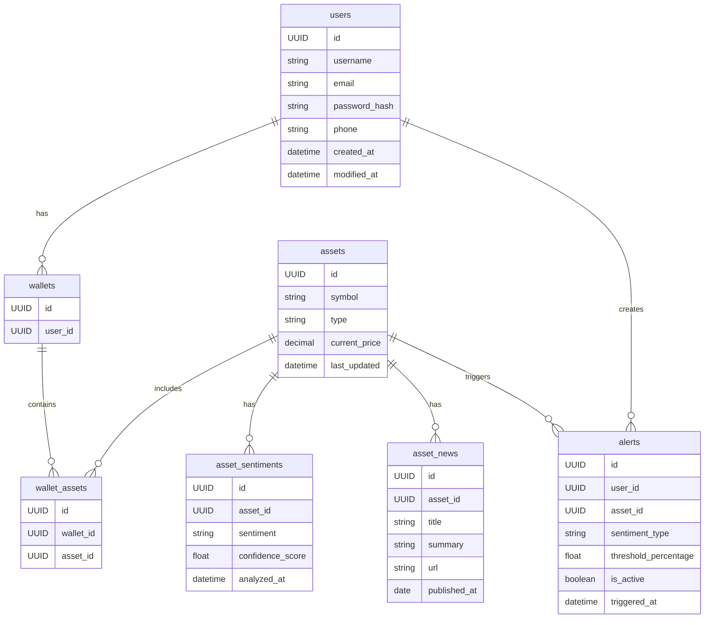
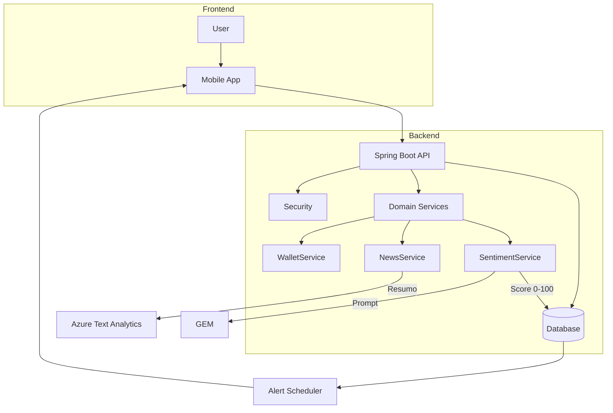

**Thetis** é uma solução **full-stack** para investidores que combina:

- 📱 **App mobile React Native** para buscar ativos em tempo real  
- ☁️ **Azure AI (Text Analytics)** + **Gemini** para analisar notícias  
- 🖥️ **Backend Java 17 / Spring Boot 3** que gerencia usuários, carteiras e alertas  
- 💾 **Oracle ou MySQL** para persistência

O sistema interpreta grandes volumes de texto, gera **nota 0-100 + Positivo/Neutro/Negativo**, destaca palavras-chave e entrega um resumo — tudo direto no celular do investidor. 📊  

---

## 🛠️ Principais Tecnologias

| Stack | Descrição |
|-------|-----------|
| **Java 17** ⚙️ | LTS, performance & segurança |
| **Spring Boot 3** 🌱 | Autoconfiguração ágil |
| **Spring Data JPA** 🗄️ | Persistência fluida |
| **OpenAPI / Swagger** 📜 | Documentação viva |
| **React Native** 📱 | App cross-platform |
| **Gemini API** 🤖 | LLM para respostas |

---

## 🎨 Figma  
https://www.figma.com/design/oGfWj2j5WEkm9pEF7GFH7I/Challenge-2025?m=auto&t=yu36BRlnbZGYmqa0-6

---

## 🏗️ Estrutura de Pastas (backend)

```text
thetis/
 ├─ src/main/java/br/com/fiap/thetis/
 │   ├─ config/          ← Configurações Spring
 │   ├─ controller/      ← Camada REST
 │   ├─ dto/             ← Data-Transfer Objects
 │   │   └─ chatbot/
 │   ├─ model/           ← Entidades JPA
 │   ├─ repository/      ← Spring Data
 │   ├─ service/         ← Regras de negócio
 │   └─ ThetisApplication.java
 ├─ src/test/            ← Testes
 ├─ pom.xml
 └─ README.md
```

---

## 🔄 Fluxo Resumido

1. 📝 **Usuário cria conta** → senha criptografada (`BCrypt`)  
2. 🔑 **Login** → recebe painel da carteira  
3. ➕ **Adiciona ativos** (`/api/wallet/add`)  
4. 📰 **Envia notícia** (`/api/news`) → backend chama o Gemini  
5. 📈 **Sentimento salvo** em `asset_sentiments`  
6. 🚨 **Alertas** monitoram ativos da carteira  

---

## 🗂️ Diagrama de Classes



---

## 🔁 Diagrama de Workflow (Fluxo de Uso)



---

## 🐳 Subindo MySQL com Docker

**Volátil**  
```bash
docker run -d --name mysql --rm   -e MYSQL_ROOT_PASSWORD=root_pwd   -e MYSQL_USER=new_user   -e MYSQL_PASSWORD=my_pwd   -e MYSQL_DATABASE=thetis   -p 3306:3306 mysql:8
```

**Persistente**  
```bash
docker run -d --name mysql   -v mysql_data:/var/lib/mysql   -e MYSQL_ROOT_PASSWORD=root_pwd   -e MYSQL_USER=new_user   -e MYSQL_PASSWORD=my_pwd   -e MYSQL_DATABASE=thetis   -p 3306:3306 mysql:8
```

---

## 🔑 Variáveis de Ambiente

| Variável | Descrição |
|----------|-----------|
| `spring.datasource.url` | JDBC URL |
| `spring.datasource.username` / `password` | Credenciais BD |
| `GEMINI_API_KEY` | Chave da API Gemini |

---

## 📜 Swagger – Exemplos

| Endpoint | Payload |
|----------|---------|
| **POST /api/users** | ```json
{{"username":"joaosilva","email":"joao@email.com","phone":"11999999999","cpf":"12345678909","password":"senha123"}}``` |
| **POST /api/users/login** | ```json
{{"usernameOrEmail":"joaosilva","password":"senha123"}}``` |
| **POST /api/wallet/add** | ```json
{{"userId":"1111...","assetId":"aaaa..."}}``` |
| **POST /api/news** | ```json
{{"title":"Petrobras recorde","summary":"A produção...","url":"https://exemplo.com","assetId":"bbbb..."}}``` |

---

## 🧪 Testes

```bash
mvn test
```

---

## ⚡ Scripts Rápidos

| Comando | Descrição |
|---------|-----------|
| `./mvnw spring-boot:run` | 🚀 Sobe o backend |
| `curl -X POST http://localhost:8080/api/chatbot/message -H "Content-Type: application/json" -d '{"message":"Tipos de renda fixa?"}'` | Teste rápido |

---
