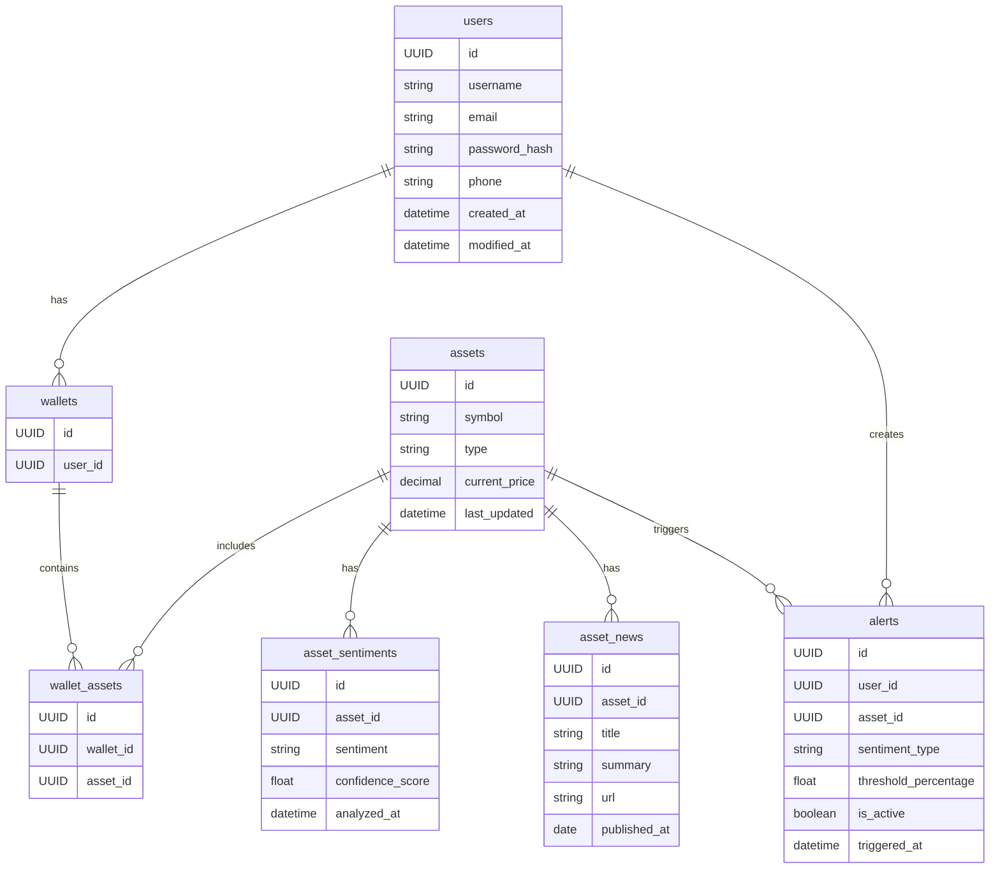

# Thetis 2025

O Thetis é um aplicativo mobile desenvolvido com React Native que permite ao usuário buscar por ativos financeiros como ações, criptomoedas e commodities, recebendo como retorno uma análise inteligente do sentimento de mercado em tempo real. Essa análise é baseada em notícias recentes,analisando e rodadno remotamente através do Azure AI (Text Analytics), com backend em Java (Spring Boot).O sistema interpreta grandes volumes de informação textual, extrai sentimentos predominantes sobre o ativo buscado, destaca palavras-chave e fornece um resumo explicativo - permitindo que investidores tomemdecisões embasadas e rápidas, diretamente do celular.

## Principais Tecnologias

- **Java 17**: Utilizar a versão LTS mais recente do Java para aproveitar as melhorias em desempenho e segurança, mantendo a compatibilidade com bibliotecas modernas.
- **Spring Boot 3**: Usar o Spring Boot 3 para agilizar o desenvolvimento com autoconfiguração inteligente, permitindo criar aplicações robustas com menos esforço.
- **Spring Data JPA**: Simplificar a camada de persistência de dados com o Spring Data JPA, proporcionando uma integração eficiente e fluida com bancos de dados relacionais.
- **OpenAPI (Swagger)**: Documentar a API com OpenAPI (Swagger), garantindo clareza na comunicação entre desenvolvedores e facilidade na manutenção dos endpoints.

## [Link do Figma]()

O Figma foi utilizado para a abstração do domínio desta API, sendo útil na análise e projeto da solução.

## Diagrama de Classes



Subir MySQL

- https://hub.docker.com/_/mysql

```sh
docker run -d \
  --name mysql \
  --rm \
  -e MYSQL_ROOT_PASSWORD=root_pwd \
  -e MYSQL_USER=new_user \
  -e MYSQL_PASSWORD=my_pwd \
  -e MYSQL_DATABASE=thetis \
  -p 3306:3306 \
  mysql:8
```